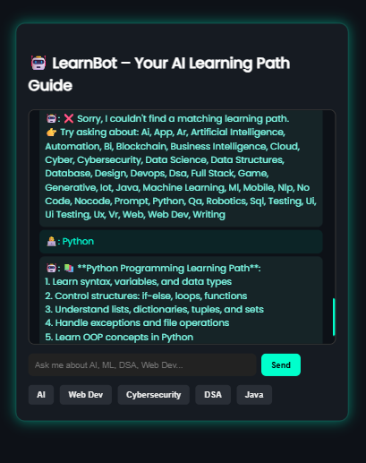

# 🤖 LearnBot AI – Interactive Learning Path Assistant

LearnBot AI is a simple web-based chatbot that helps users discover structured learning paths in various tech fields like Java, Full Stack, AI, Web Development, Python, DSA, and more.

> 🚀 Built with Flask · HTML · CSS · Python · JSON

---

## 🔍 Features

- 💬 Ask for learning paths in natural language  
- 🧠 Smart keyword recognition (e.g., "How to start Java?" → shows Java roadmap)  
- 📚 Supports 25+ learning paths: AI, Full Stack, DSA, ML, DevOps, Cybersecurity, etc.  
- 🌙 Clean and modern dark UI  
- 🗂️ Modular code structure with Flask backend and JSON-based data

---

## 📸 Preview

<p align="center">
  
</p>


---

## 🛠️ Tech Stack

- **Frontend:** HTML5, CSS3 (Dark Theme)
- **Backend:** Python (Flask)
- **Data Format:** JSON
- **Bot Logic:** Regex + JSON Mapping

---

## 🧑‍💻 How to Run Locally

1. **Clone the repository**  
   ```
   git clone https://github.com/mani-chandrika549/learnbot-ai.git
   cd learnbot-ai
   ```

2. **Create a virtual environment (optional but recommended)**  
   ```
   python -m venv venv
   source venv/bin/activate  # On Windows: venv\Scripts\activate
   ```

3. **Install dependencies**  
   ```
   pip install flask
   ```

4. **Run the app**  
   ```
   python app.py
   ```

5. **Open your browser**  
   Go to: `http://127.0.0.1:5000`

---

## 📁 Project Structure

```
learnbot-ai/
├── app.py
├── learning_paths.json
├── logic/
│   └── bot_logic.py
├── templates/
│   └── index.html
├── static/
│   └── style.css
└── README.md
```

---

## 🌟 Learning Paths Supported

Java, Python, Full Stack, AI, Machine Learning, DSA, Web Dev, App Dev, Cybersecurity, DevOps, Blockchain, NLP, UI/UX, Cloud, Game Dev, Prompt Engineering, IoT, and many more!

---

## 🧠 Inspiration

This bot was built to help beginners and job-seekers quickly understand what to learn next in tech without getting overwhelmed by scattered resources.

---

## 🙋‍♀️ Author

**Mani Chandrika**  
💼 B.Tech CSE Student | Tech Enthusiast  
📬 [LinkedIn](https://www.linkedin.com/in/mani-chandrika549)

---

## 📌 License

This project is open-source under the [MIT License](LICENSE).
